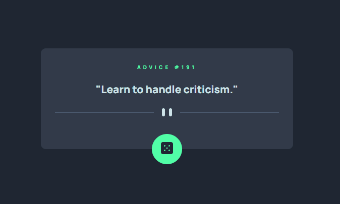

# Advice Generator - Frontend Mentor

## Projeto completo com HTML, CSS e JavaScript

Exercício baseado no [desafio do Frontend Mentor](https://www.frontendmentor.io/challenges/advice-generator-app-QdUG-13db).

Desenvolvi toda a estrutura do código como forma de estudo e aplicação dos fundamentos para o consumo de uma API.
Portanto, o conteúdo dos cartões se mantém sempre dinâmico, gerando um novo conselho aleatório tanto ao carregar a página quanto ao clicar no botão.

## Resultado

Acesse a página no ar [clicando aqui](https://guihcastro.github.io/advice-generator-frontend-mentor/).

## Tecnologias utilizadas

-  HTML 
-  CSS 
-  JavaScript 
